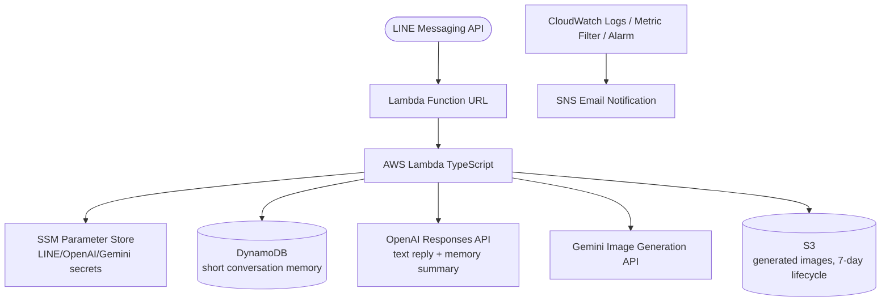

# Kuma LINE Bot CDK

「くま」という名前の犬のLINE botをAWS CDKでデプロイするプロジェクトです。くまは冗談がうまく、絵を描くのも得意な「くま画伯」で、普段の会話に加えて画像生成にも対応します。

この構成は家庭内の少量トラフィック向けに寄せてあり、低コスト・低複雑性を優先しています。会話メモリはDynamoDBに「短い要約だけ」を保持し、長い履歴は保存しません。

## Architecture



## What It Does

- LINE webhookをLambda Function URLで受け取る
- LINE署名を検証する
- テキスト会話ではOpenAIに問い合わせて、くまの人格で短く返答する
- 画像依頼では、Geminiでくま画伯として画像を生成して返す
- ユーザーごとに短い会話メモをDynamoDBへ保存する
- Lambda / OpenAIエラーをCloudWatch + SNSで通知する

## Memory Design

長い会話履歴は持たず、ユーザーごとに1レコードだけを保存します。

### DynamoDB table

Table name:

`ConversationMemory`

Partition key:

`pk` (string)

Example:

`USER#Uxxxxxxxxxxxx`

Attributes:

- `profile_summary`
- `recent_summary`
- `open_loops`
- `updated_at`

### Size limits

コストを抑えるため、メモリは必ず圧縮します。

- `profile_summary`: 120文字目安
- `recent_summary`: 160文字目安
- `open_loops`: 最大3件、各30文字程度まで

モデルへの指示だけでなく、保存前にコード側でも強制的に切り詰めています。メモリは時間とともに肥大化しない前提です。

### Why this design

- 家族利用で1日10件前後なので、全文保存より短い要約の方が安い
- 次の返答に必要な文脈だけを残せる
- RAGやベクトルDBなしで十分運用できる
- くまの人格を保ったまま、前回の流れを自然に拾える

## Environment Variables

### Deploy-time environment variables

CDK実行時に以下を設定します。

```bash
export CHANNEL_SECRET_PARAM_NAME="/line-bot/kuma/channelSecret"
export CHANNEL_ACCESS_TOKEN_PARAM_NAME="/line-bot/kuma/channelAccessToken"
export OPENAI_API_KEY_PARAM_NAME="/line-bot/kuma/OpenAIAPIKEY"
export AIAND_API_KEY_PARAM_NAME="/line-bot/kuma/AIANDAPIKEY"
export GEMINI_API_KEY_PARAM_NAME="/line-bot/kuma/GeminiAPIKEY"
export EMAIL_ADDRESS="your-alert@example.com"
```

### Lambda runtime environment variables

Lambdaには以下が設定されます。

- `CHANNEL_SECRET_PARAM_NAME`
- `CHANNEL_ACCESS_TOKEN_PARAM_NAME`
- `OPENAI_API_KEY_PARAM_NAME`
- `AIAND_API_KEY_PARAM_NAME`
- `GEMINI_API_KEY_PARAM_NAME`
- `IMAGES_BUCKET_NAME`
- `CONVERSATION_MEMORY_TABLE_NAME`

このうち秘密値そのものはLambda環境変数へ入れず、SSM Parameter Storeから実行時に取得します。

## Secrets in SSM Parameter Store

```bash
aws ssm put-parameter \
  --name "/line-bot/kuma/channelSecret" \
  --value "your-channel-secret" \
  --type "SecureString" \
  --overwrite

aws ssm put-parameter \
  --name "/line-bot/kuma/channelAccessToken" \
  --value "your-channel-access-token" \
  --type "SecureString" \
  --overwrite

aws ssm put-parameter \
  --name "/line-bot/kuma/AIANDAPIKEY" \
  --value "your-aiand-api-key" \
  --type "SecureString" \
  --overwrite

aws ssm put-parameter \
  --name "/line-bot/kuma/OpenAIAPIKEY" \
  --value "your-openai-api-key" \
  --type "SecureString" \
  --overwrite

aws ssm put-parameter \
  --name "/line-bot/kuma/GeminiAPIKEY" \
  --value "your-gemini-api-key" \
  --type "SecureString" \
  --overwrite
```

## Deployment

Requirements:

- Node.js 22+
- AWS CLI
- AWS CDK CLI

Commands:

```bash
npm install
cdk bootstrap
npm run build
npm test
npx cdk synth
npx cdk deploy
```

> [!NOTE]
> GitHub Actions の `deploy` workflow は、デプロイ先AWS環境で `cdk bootstrap` が事前に完了していることを前提にしています。  
> CI では `cdk bootstrap` を実行しないため、未bootstrap環境へ初回デプロイする場合はローカル等で先に `cdk bootstrap` を実行してください。

デプロイ後、CloudFormation Outputsに少なくとも以下が表示されます。

- `FunctionUrl`
- `ImagesBucketUrl`
- `ConversationMemoryTableName`
- `ErrorNotificationTopicArn`

## LINE Webhook Setup

1. `cdk deploy` 後に `FunctionUrl` を取得する
2. LINE Developers ConsoleでMessaging APIのWebhook URLに設定する
3. Webhookを有効化する
4. 必要なら「応答メッセージ」はオフにする

このプロジェクトはAPI GatewayではなくLambda Function URLをそのままWebhook endpointとして使います。

## Testing

```bash
npm run build
npm test
```

現在のテストでは主に以下を確認します。

- スタックにLambdaが作成されること
- 会話メモ用DynamoDBテーブルが作成されること
- メモリ圧縮ルールがコードで強制されること

## Cost Notes

低コスト化のために以下を採っています。

- Lambda Function URLを使用し、API Gatewayを追加しない
- DynamoDBは1テーブルのみ、オンデマンド課金
- 会話履歴は全文保存せず、短い要約だけ保持
- 画像はS3へ保存し、7日後に自動削除
- 画像依頼の判定はルールベースで行い、不要なOpenAI呼び出しを減らす
- SSMで取得したクライアント設定はLambda実行環境内で再利用する

## Future Improvements

- 会話メモ更新の精度を上げるための軽いプロンプト調整
- 画像依頼判定ルールの微調整
- 最小限のスナップショットテスト追加
- 会話メモの品質を確認する運用ログ整備
